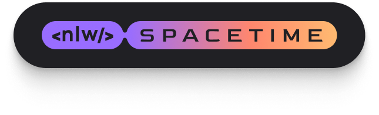
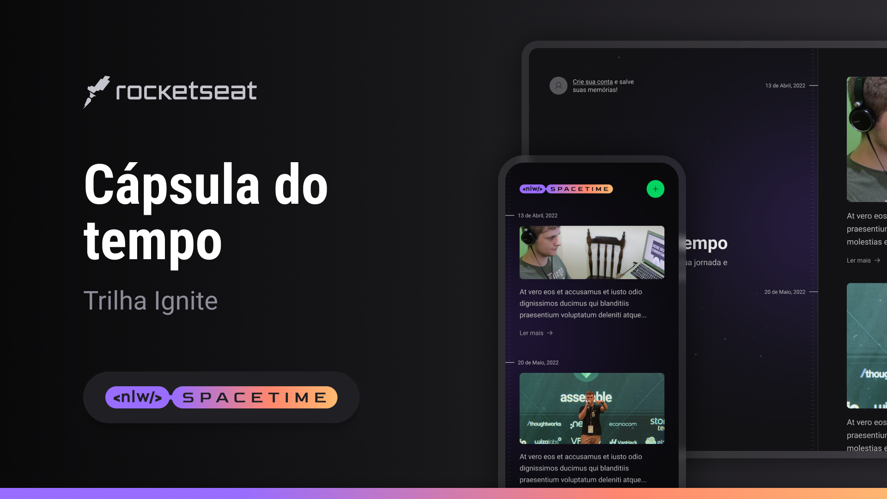
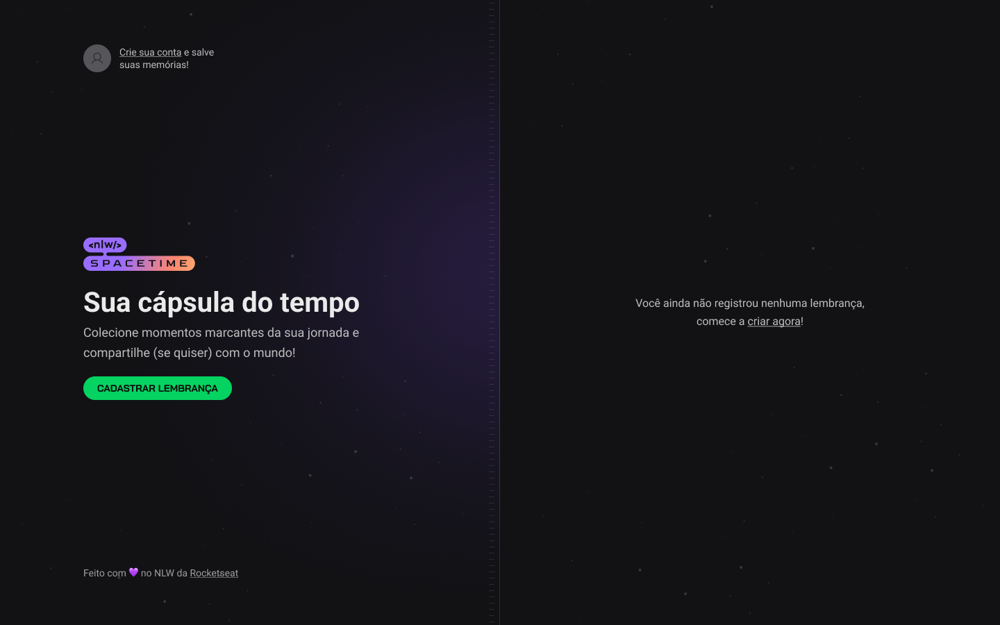
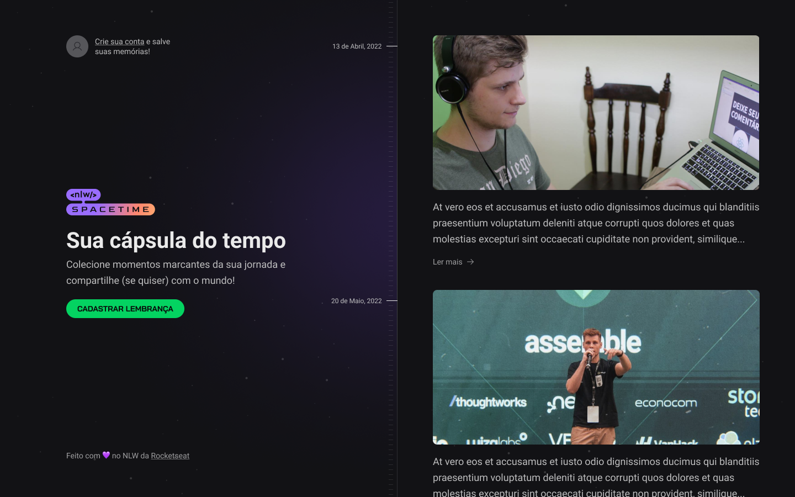
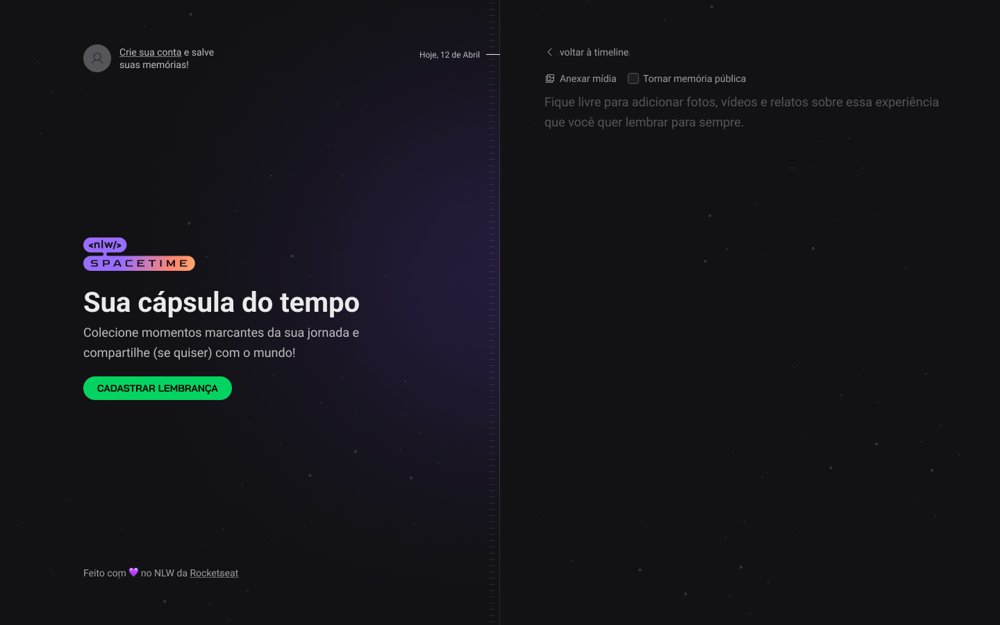
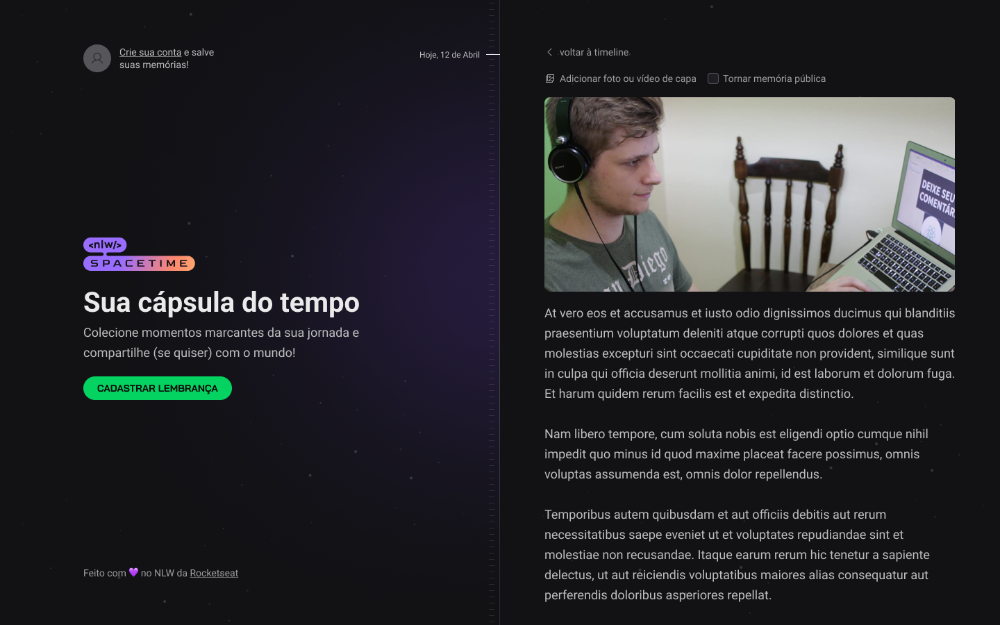
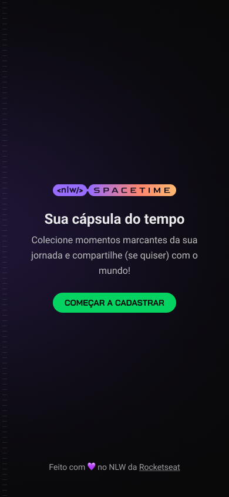
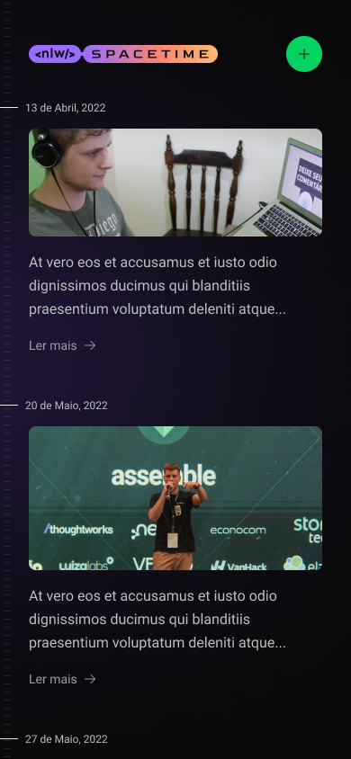
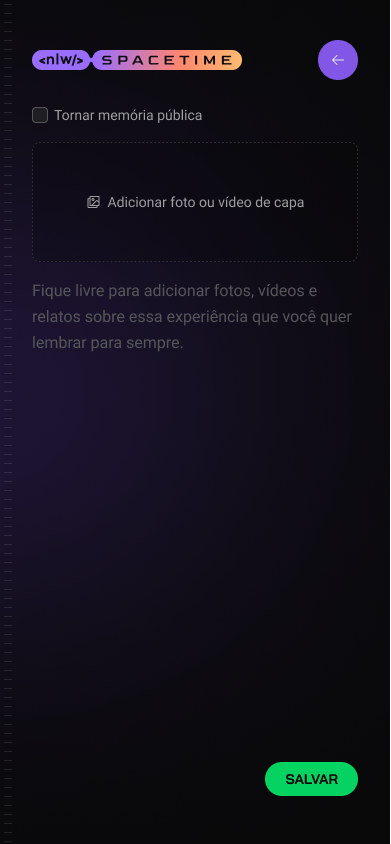

<h1 align="center">
    
</h1>

<p align="center">
  

  
  
  <a href="https://github.com/pabloxt14/NLW-Spacetime/commits/master">
    
  </a>
    
   

   <a href="https://github.com/pabloxt14/NLW-Spacetime/stargazers">
    
  </a>
</p>

<p>
  
</p>

<h4 align="center"> 
	🚀 NLW Spacetime Concluído 🚀
</h4>

<p align="center">
 <a href="#-about">About</a> |
 <a href="#-layout">Layout</a> | 
 <a href="#-how-it-works">How It Works</a> | 
 <a href="#-technologies">Technologies</a> | 
 <a href="#-author">Author</a> | 
 <a href="#-license">License</a>
</p>


## 💻 About

Neste projeto, desenvolvemos uma aplicação full-stack, do back-end ao mobile, que atua como uma cápsula do tempo, registrando memórias passadas em uma timeline. Utilizamos tecnologias como React, Tailwind, Node, Fastify, TypeScript, Expo, Next.js e muito mais!

O projeto foi desenvolvido durante a **NLW - Next Level Week** oferecida pela [Rocketseat](https://blog.rocketseat.com.br/primeira-next-level-week/). O NLW é uma experiência online com muito conteúdo prático, desafios e hacks onde o conteúdo fica disponível durante uma semana.

---

## 🎨 Layout

Você pode visualizar o layout do projeto através [desse link](https://www.figma.com/community/file/1240070456276424762). É necessário ter conta no [Figma](https://www.figma.com/) para acessá-lo.

### Web

<p align="center">
  <h4>No memories</h4>
  

  <h4>Memories</h4>
  

  <h4>Create</h4>
  

  <h4>Create (Filled)</h4>
  
</p>

### Mobile

<p align="center">
  <h4 align="center">Splash</h4>
  

  <h4 align="center">Home (Pre Login)</h4>
  

  <h4 align="center">Memories</h4>
  

  <h4 align="center">Create</h4>
  
</p>

---

## 🚀 How it works

Este projeto é divido em três partes:
1. Backend (pasta server) 
2. Frontend (pasta web)
3. Mobile (pasta mobile)

💡Tanto o Frontend quanto o Mobile precisam que o Backend esteja sendo executado para funcionar.

### Pré-requisitos

Antes de baixar o projeto você vai precisar ter instalado na sua máquina as seguintes ferramentas:

* [Git](https://git-scm.com)
* [NodeJS](https://nodejs.org/en/)
* [Yarn](https://yarnpkg.com/) ou [NPM](https://www.npmjs.com/)

Além disto é bom ter um editor para trabalhar com o código como [VSCode](https://code.visualstudio.com/)

#### 🎲 Rodando o Backend (servidor)

```bash
# Clone este repositório
$ git clone git@github.com:pabloxt14/NLW-Spacetime.git

# Acesse a pasta do projeto no terminal/cmd
$ cd NLW-Spacetime

# Vá para a pasta server
$ cd server

# Instale as dependências
$ npm install

# Configurar variáveis de ambiente

# Execute a aplicação em modo de desenvolvimento
$ npm run dev

# O servidor inciará na porta:3333 - acesse http://localhost:3333 
```

#### 🧭 Rodando a aplicação web (Frontend)

```bash
# Vá para a pasta da aplicação Front End
$ cd web

# Instale as dependências
$ npm install

# Configurar variáveis de ambiente

# Execute a aplicação em modo de desenvolvimento
$ npm run dev

# A aplicação será aberta na porta:3000 - acesse http://localhost:3000
```

#### 📱 Rodando a aplicação mobile (Mobile)

```bash
# Vá para a pasta da aplicação mobile
$ cd mobile

# Instale as dependências
$ npm install

# Execute a aplicação em modo de desenvolvimento
$ npx expo start
```

---

## 🛠 Technologies

As seguintes ferramentas foram usadas na construção do projeto:

#### **Website**  ([Next.js](https://nextjs.org/)  +  [TypeScript](https://www.typescriptlang.org/))

-   **[tailwindCSS](https://tailwindcss.com/)**
-   **[postcss](https://postcss.org/)**
-   **[lucide-react](https://lucide.dev/)**
-   **[jwt-decode](https://www.npmjs.com/package/jwt-decode)**
-   **[js-cookie](https://github.com/js-cookie/js-cookie)**
-   **[axios](https://github.com/axios/axios)**
-   **[dayjs](https://day.js.org/)**

> Veja o arquivo  [package.json](./web/package.json)

#### **Server**  ([Node.js](https://nodejs.org/en/)  +  [TypeScript](https://www.typescriptlang.org/))

-   **[fastify](https://www.fastify.io/)**
-   **[zod](https://github.com/colinhacks/zod)**
-   **[tsx](https://www.npmjs.com/package/tsx)**
-   **[prisma](https://www.prisma.io/)**
-   **[sqlite](https://github.com/mapbox/node-sqlite3)**
-   **[axios](https://github.com/axios/axios)**
-   **[dotenv](https://www.npmjs.com/package/dotenv)**
-   **[@fastify/cors](https://github.com/fastify/fastify-cors)**
-   **[@fastify/jwt](https://github.com/fastify/fastify-jwt)**
-   **[@fastify/multipart](https://github.com/fastify/fastify-multipart)**
-   **[@fastify/static](https://github.com/fastify/fastify-static)**

> Veja o arquivo  [package.json](./server/package.json)

#### **Mobile**  ([React Native](http://www.reactnative.com/)  +  [TypeScript](https://www.typescriptlang.org/))
 
-   **[expo](https://expo.io/)**
-   **[expo-fonts](https://docs.expo.dev/guides/using-custom-fonts/)**
-   **[expo-google-fonts](https://github.com/expo/google-fonts)**
-   **[expo-auth-session](https://docs.expo.dev/versions/latest/sdk/auth-session/)**
-   **[expo-image-picker](https://docs.expo.dev/versions/latest/sdk/imagepicker/)**
-   **[expo-router](https://expo.github.io/router/docs/)**
-   **[expo-secure-store](https://docs.expo.dev/versions/latest/sdk/securestore/)**
-   **[nativewind](https://www.nativewind.dev/)**
-   **[react-native-svg](https://github.com/software-mansion/react-native-svg)**
-   **[react-native-svg-transformer](https://github.com/kristerkari/react-native-svg-transformer)**
-   **[axios](https://github.com/axios/axios)**
-   **[dayjs](https://day.js.org/)**
-   **[dotenv](https://www.npmjs.com/package/dotenv)**

> Veja o arquivo  [package.json](./mobile/package.json)

---

## ✍ Author


[](https://www.linkedin.com/in/pabloalan/)

[](mailto:pabloxt14@gmail.com)

---

## 📝 License

Este projeto está sob a licença MIT. Consulte o arquivo [LICENSE](./LICENSE) para mais informações

Feito com 💜 por Pablo Alan 👋🏽 [Entre em contato!](https://www.linkedin.com/in/pabloalan/)